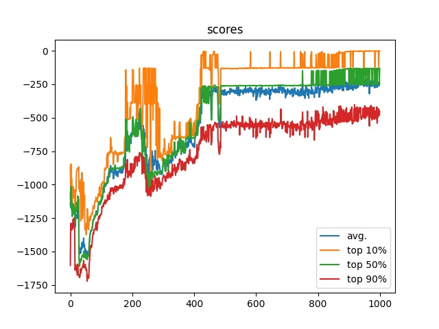

# DQN c n-steps bootstrapping 

Аналогична [DQN v.1](../DQN_v1), но с указанным количеством учитываемых промежуточных шагов. Требует более плавного снижения `exploreRate` и дольше обучается, но находит более стабильные стратегии.

Как видно, даже в худших случаях агент выдаёт стабильные результаты, но очень долго обучается действовать оптимальным образом в остальных случаях. Интересно, что агент смог найти точки в которых достаточно прилагать постоянное усилие, чтоб маятник оставался в близком к вертикальному положению. Собственно, агент стремится максимально быстро привести маятник в одно из этих положений.