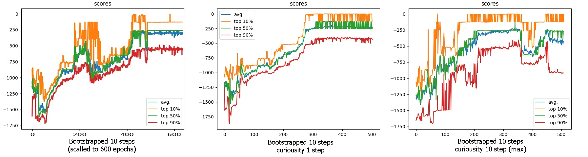

# DQN + bootstrapping + curiousity

Попытка применить идею curiousity. Разбор идеи curiousity - [тут](https://www.youtube.com/watch?v=_Z9ZP1eiKsI).

Вторая сеть сделана специально большой, чтоб иметь возможность быстро начать аппроксимировать следующее состояние по предыдущему и action.

В оригинале используют ещё и сжатие/очистку state (модуль ICM использует encoder/decoder, чтоб выделять только важную информацию), но тут state и так максимально прост, поэтому я их не использовал.

Как видно, процесс обучения существенно ускорился и агент быстро находит оптимальные стратегии в большинстве случаев.

Вообще, крайне неоднозначное сложилось впечатление о данном варианте обучения DQN. Вроде как процесс ускорился, стабильность достаточно высокая, но очень много нюансов, которые не совсем понятны. Например:

- Не вносит ли вторая сеть просто шум, который позволяет быстрее исследовать среду? Обучается ли вообще она предсказывать следующее состояние или, в итоге, лишь копирует входные данные? Действительно ли агент начинает исследовать перспективные ситуации?
- Что делать в конце обучения? Ведь агент обучается учитывать вероятность узнать новое о среде, но это является нежелательным поведением при реальном использовании агента. Дообучать агента уже без curiousity?
- Как эффективно учитывать curiousity? Просто складывать reward от среды и от curiousity? Их диапазон может отличаться очень сильно и агент либо будет занят исключительно исследованием мира, либо сигнал curiousity будет слишком незначительным.
- Если учитываются следующие N шагов, то как должна учитываться curiousity? Сумма? Сумма с дискаунтом? Среднее? Я использовал максимум за N шагов, но не факт что это оптимально.
- Если уж на то пошло, то не лучше ли, например, сделать агента отвечающего за исследование и как-то складывать решения двух агентов? Не epsilon-greedy, а типа как curiousity-greedy.
