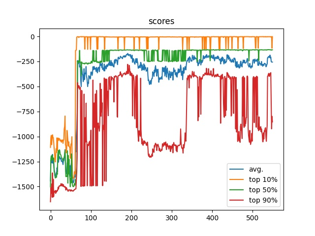

# DQN (v. 1?)

Используется примитивная DQN, которая предсказывает "выгоду" от выполнения одного из двух действий:
- максимально сильно толкать маятник **влево**.
- максимально сильно толкать маятник **вправо**.

Особенности данной реализации:
- Сеть специально была выбрана очень маленькая и простая.
- DQN работает с конечным числом действий и можно было разделить интервал -1..1 на большее число подинтервалов/действий, но, опять же, я не хотел сразу же усложнять.
- Использовался приоритезированный replay buffer, который хранит целиком эпизоды и отбрасывает эпизоды, которые не набрали достаточно очков. У этого подхода свои плюсы и минусы, есть много способов улучшить процесс обучения, но данный подход мне показался уместнее, чем просто хранить последние N сэмплов.
- Использовался упрощённый вариант уравнения Беллмана. Обычно есть параметр *alpha*, который позволяет более плавно аппроксимировать Q(s, a), но взял, для простоты, его за 1.
- Процесс обучения и тестирования полностью разделены. Часто реализуют он-лайн обучение, дообучая агента после каждого шага тестирования, но это запутанно, плохо оптимизируется и скрывает реальные затраты на обучение. Хотя, конечно, если слишком затратно получать новые данные об окружении, то предподчтительное использовать он-лайн обучение.
- Логика агента и обучения разделены. Опять же, обычно агент отвечает и за выбор действий, и за процесс обучения, что некорректно.
- На каждой эпохе, для обучения сети используется её старая копия. Не факт что это существенно улучшает процесс, но хоть немного повышает стабильность сети.

Параметры обучения:
```
BATCH_SIZE = 512
TRAIN_EPISODES = 50 # количество шагов обучения в каждой эпохе
TEST_EPISODES = 256 # количество тестовых симуляций
EXPLORE_RATE = .5 # базовый шанс случайного действия
EXPLORE_RATE_DECAY = .9 # скорость снижения шанса случайного действия (на 60 эпохе он становится равным 1к1000 и больше не снижается)
EPOCHS = 1000 # максимальное количество эпох
GAMMA = .9 # ограничиваем горизонт предсказания где-то 40 шагами симуляции
```

На каждой эпохе происходит обучение на 256000 сэмплах (TRAIN_EPISODES * BATCH_SIZE).

Пример одной сессии обучения:


Первые 60 эпох происходит exploration, поэтому агент почти не набирает очков. Далее уже симуляциями почти полностью управляет агент и быстро находит способ набирать в 10% игр близкое к максимальному количеству очков. В 50% игр бот показывает стабильно хороший результат. Эффективность же решений агента в худших для него условиях сильно варьируется. Скорее всего, приоритезированный replay buffer переполняется примерами со слишком хорошими начальными условиями и теряет примеры поведения в менее благоприятных условиях.