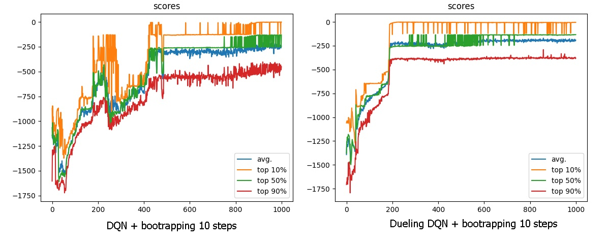

# (Double?) Dueling DQN c n-steps bootstrapping

Достаточно простая и интересная модификация самой сети. Сеть делится на две подсети, одна из них вычисляет среднюю награду, а вторая - отклонение от неё при выборе одного из действий. Казалось бы, это только усложняет сеть, а результат остаётся тем же (по сути нет разницы между, условно, `[1, 1.1]` и `1.05 + [-0.05, 0.05]`), но каждая подсеть адаптируется под свою задачу и достигает большей точности.

Сеть обучалась с теми же параметрами, что и [DQN c n-steps bootstrapping](../DQN_bootstrap):

```
BATCH_SIZE = 512
TRAIN_EPISODES = 25
TEST_EPISODES = 256
EXPLORE_RATE = .5 
EXPLORE_RATE_DECAY = .95
EPOCHS = 1000
GAMMA = .9
ACTIONS = MappedActions(N=9, valuesRange=(-1, 1))
BOOTSTRAPPED_STEPS = 10
```

Результаты:



