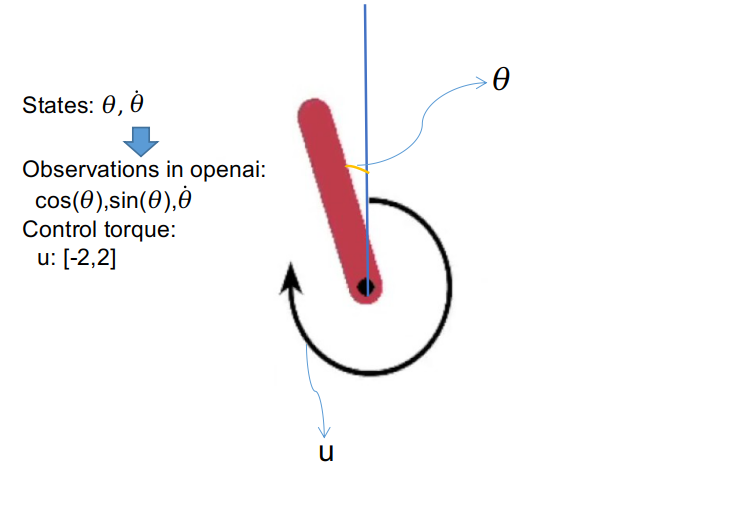

# Pendulum enviroment

Одно из самых простых окружений/игр из OpenAI Gym. Состояние описано тремя значениями:
- косинус и синус текущего угла поворота.
- текущая скорость вращения.

Управляется окружение одним значением - "сила" прилагаемая в текущий момент.

**PendulumEnviroment.py** - обёртка над стандартным окружением. Текущая скорость нормализируется до диапазона -1..1. Прилагаемая сила так же приводится к -1..1. Награда отдаётся в виде дельты между старой и новой наградой (которая является очками за игру). Так же, предоставлен минимальный дополнительный функционал, который облегчает работу с окружением.

Основная цель: привести маятник в вертикальное положение,  из любого начального положения, и удерживать максимально долго (по-умолчанию, даётся 200 шагов на одну симуляцию).

Задача выглядит очень простой для человека, но требует интуитивного понимания физики и умения планировать. Например, раскачивание маятника из стороны в сторону является вполне логичным способом **в итоге** перевести маятник в вертикальное положение, но это, само по себе, кажется ошибкой: мы намеренно теряем очки, хоть цель в их наборе (мы разгоняем маятник двигая его в нижнюю точку, что уменьшает счёт).

[Простейший вариант DQN](DQN_v1)