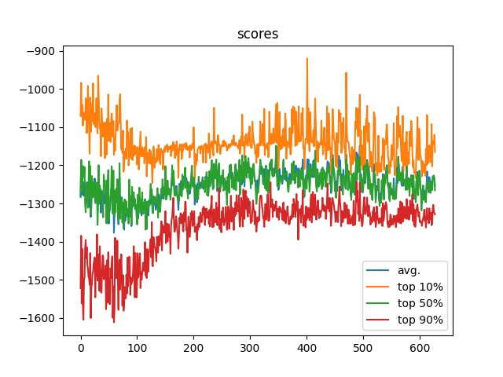

# Vanilla Reinforce

Один из самых базовых policy based алгоритмов. Без baseline, нормализации и др. Обучается крайне плохо, возможно ошибся в нюансах реализации, но общий смысл подхода понял.

Так же, часто явно считают градиенты, используют `GradientTape` в примерах, но выдавало ошибку + как-то громоздко смотрелось. Сделал модель-обёртку, которая внутри считает уже loss и обучает основную модель.

Пробовал использовать `Experience Buffer` и др. оптимизации - результаты неоднозначны. Алгоритму требуется слишком много времени на каждый цикл обучения, поэтому не удалось сравнить различные варианты.

